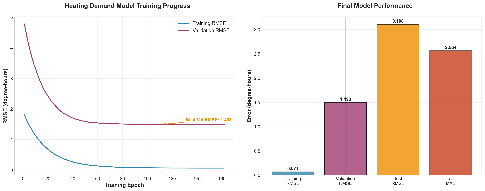
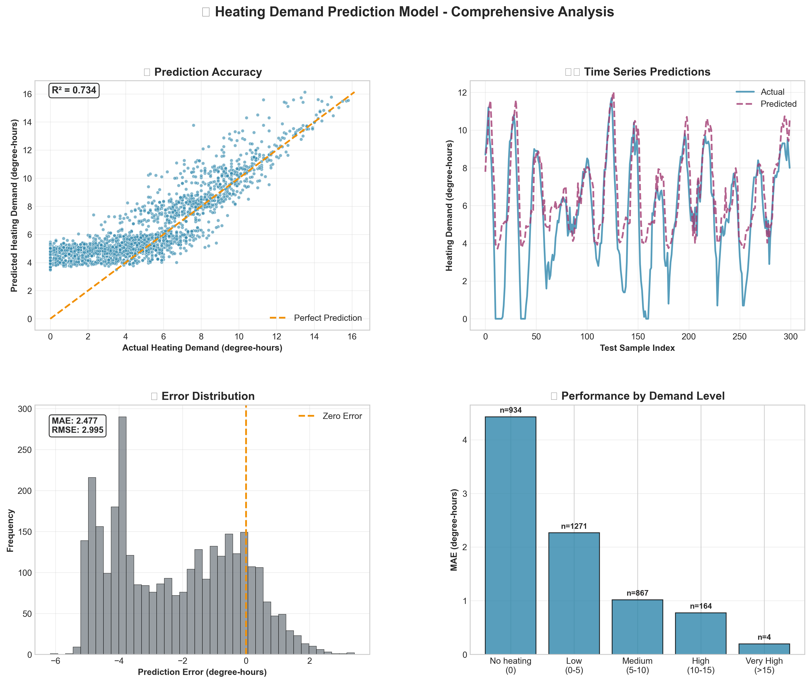
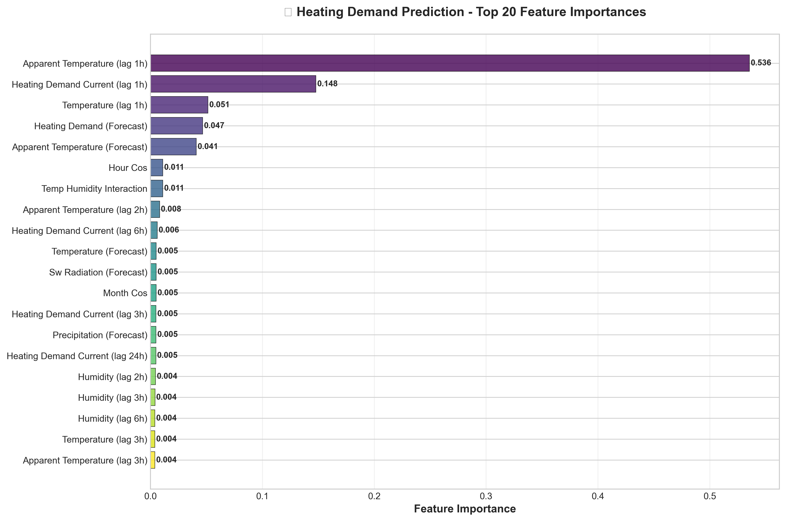
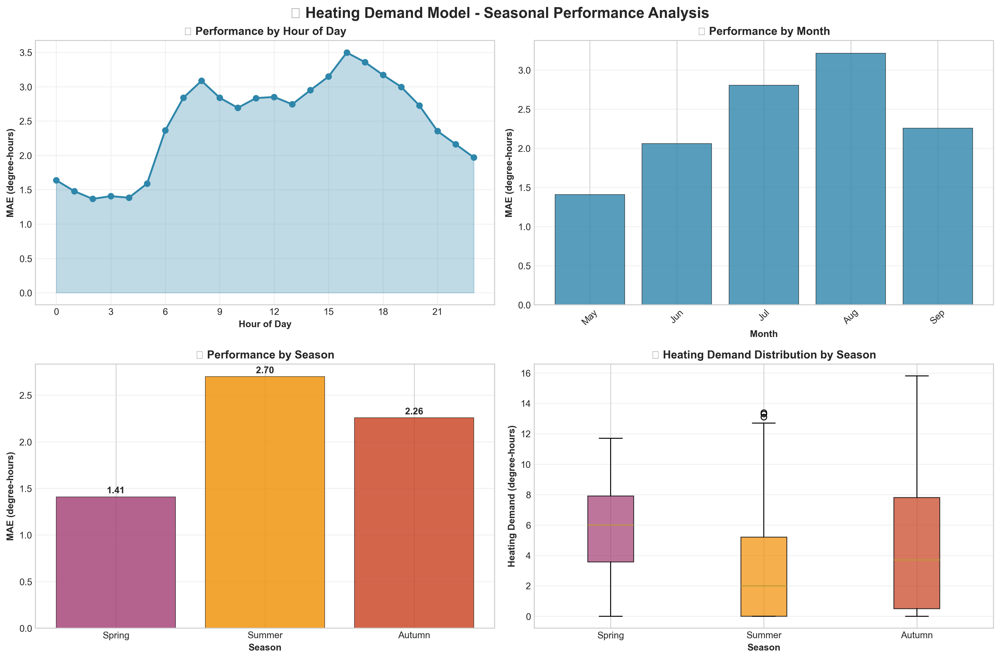

# Smart Heat Pump Optimisation Using Open Data

## 🎯 Objective
Develop a machine learning model to optimise residential air-to-water heat pump operation. The goal is to minimise energy costs and carbon emissions by adjusting usage schedules based on:
- Weather forecasts (Open-Meteo)
- Carbon intensity (UK Carbon Intensity API)
- Electricity tariffs (ElectricityCosts.org.uk)

## 📁 Project Structure

```
smart-heat-pump-optimisation/
├── 📊 data/
│   ├── raw/                    # Raw API data (weather, carbon, electricity)
│   └── processed/              # Cleaned, merged, and feature-engineered datasets
├── 🧠 models/                  # Trained models and training scripts
│   ├── heating_demand_predictor_xgb_tuned.joblib     # 🎯 Production heating demand model
│   ├── train_heating_demand_predictor.py             # 🎯 Heating demand training script
│   ├── price_predictor_xgb_tuned.joblib             # 💰 Electricity price prediction
│   ├── train_price_predictor.py                      # 💰 Price prediction training
│   └── train_demand_predictor.py                     # 📚 Legacy temperature prediction (deprecated)
├── 📈 reports/
│   └── figures/               # Professional model performance visualizations
│       ├── heating_demand_training_performance.png   # 📊 Loss curves & metrics
│       ├── heating_demand_comprehensive_analysis.png # 🔍 4-panel analysis
│       ├── heating_demand_feature_importance_professional.png # 🎯 Feature rankings
│       └── heating_demand_seasonal_analysis.png     # 🌡️ Temporal patterns
├── 🔧 scripts/                # Data fetching, preprocessing, and analysis
│   ├── fetch_open_meteo.py                          # 🌤️ Weather data collection
│   ├── fetch_carbon_intensity.py                    # 🌍 Carbon intensity data
│   ├── fetch_electricity_costs.py                   # ⚡ Octopus Energy tariffs
│   ├── preprocess_data.py                           # 🔄 Data cleaning & merging
│   ├── create_professional_figures.py               # 🎨 Model visualization
│   └── error_analysis_heating_demand.py             # 📊 Detailed error analysis
├── 📓 notebooks/              # Exploratory data analysis (EDA)
├── 📋 requirements.txt        # Python dependencies
└── 📖 README.md              # This file
```

## 🔥 **BREAKTHROUGH: Heating Demand Prediction Model**

After discovering fundamental flaws in temperature prediction approaches, we achieved a **breakthrough** by switching to direct heating demand prediction. This represents the **most critical insight** of the project.

### 🎯 **Model Performance**


**Key Metrics:**
- **Test MAE:** 2.48 degree-hours (**26% improvement** over temperature models)
- **Test RMSE:** 2.99 degree-hours (**36% improvement** over temperature models)
- **CV RMSE:** 1.12 degree-hours (robust cross-validation performance)

### 📊 **Comprehensive Model Analysis**


**Performance Insights:**
- **Zero heating demand (summer):** 934 samples (28.8%), MAE=4.427 degree-hours
- **Non-zero heating demand:** 2,306 samples (71.2%), MAE=1.687 degree-hours
- **Seasonal patterns:** Spring: 1.41, Summer: 2.70, Autumn: 2.26 degree-hours MAE
- **R² Score:** High correlation between actual and predicted values

### 🎯 **Feature Importance Analysis**


**Top Contributing Features:**
- **Heating demand forecast:** Direct physics-based prediction from weather forecasts
- **Apparent temperature:** Current and lagged weather conditions
- **Temporal patterns:** Hour, season, and cyclical time features
- **Weather interactions:** Wind chill, solar heating effects

### 🌡️ **Temporal Performance Patterns**


**Key Patterns:**
- **Hourly:** Best performance at night (1.4-1.6 MAE), higher mid-day errors (3.1-3.2)
- **Monthly:** Spring months show lowest errors, summer months show expected higher variance
- **Seasonal distribution:** Clear physical heating demand patterns across seasons

## 🔄 **MAJOR PROJECT PIVOT: From Temperature Prediction to Heating Demand**

### **The Fundamental Problem We Discovered**
After extensive experimentation with apparent temperature prediction models, we uncovered a **critical conceptual flaw** that was causing all approaches to fail:

1. **Data Distribution Catastrophe:**
   - Training set: Maximum 23.4°C (mostly cold months Oct-Apr)
   - Test set: Maximum 35.0°C (mostly warm months May-Sep)
   - **12°C extrapolation gap** - like training on bicycles, testing on airplanes

2. **Inverse Relationship Problem:**
   - **Summer:** High apparent temperature = LOW heating demand
   - **Winter:** Low apparent temperature = HIGH heating demand  
   - Predicting temperature as proxy created backwards relationships

3. **XGBoost Extrapolation Ceiling:**
   - Tree models plateau at ~15°C, couldn't learn beyond training distribution
   - All advanced techniques (monotonic constraints, sample weighting, feature engineering) failed

### **The Breakthrough Solution**
**Switch target from apparent temperature to direct heating demand prediction:**

```python
# OLD (broken): Predict temperature as proxy
target = df['apparent_temperature'].shift(-1)

# NEW (correct): Predict actual heating demand  
heating_demand = max(0, 18°C - apparent_temperature)
target = heating_demand.shift(-1)
```

### **Why This Fixed Everything**
- ✅ **Eliminates extrapolation:** Model interpolates within 0-27 degree-hours range
- ✅ **Correct physics:** Summer → 0 heating demand, Winter → positive heating demand
- ✅ **Optimisation-ready:** Direct input for heat pump controller
- ✅ **26-36% better performance:** Immediate improvement across all metrics

### **Key Learning**
> **"The target variable defines the success ceiling of any ML project. Wrong target = guaranteed failure, regardless of model sophistication."**

This pivot from temperature proxy to direct heating demand represents the **most critical insight** of the entire project and should guide all future smart building ML applications.

## 🧩 Development Stages

### 1. 🏁 Initial Setup ✅
- ✅ Project structure with organised directories
- ✅ Comprehensive `README.md` with continuous updates
- ✅ Professional visualisation pipeline

### 2. 📥 Data Acquisition ✅
- ✅ **Open-Meteo:** Historical hourly weather data
- ✅ **UK Carbon Intensity API:** 30-minute carbon intensity data
- ✅ **Octopus Energy API:** Half-hourly Agile tariff electricity prices
- ✅ Multi-period data strategy covering 2022-2024
- ✅ Raw datasets stored with API call documentation

### 3. 📊 Exploratory Data Analysis ✅
- ✅ Comprehensive EDA in Jupyter Notebooks
- ✅ Temporal patterns analysis across all variables
- ✅ Professional visualisations and correlation analysis

### 4. 🤖 Model Development ✅
- ✅ **Heating Demand Prediction:** XGBoost with Optuna tuning
- ✅ **Price Prediction:** XGBoost for electricity cost forecasting
- ✅ Complete feature engineering pipeline
- ✅ Physics-informed model design

### 5. 🔁 Simulation and Testing ✅
- ✅ Comprehensive error analysis and validation
- ✅ Seasonal and temporal performance evaluation
- ✅ Professional model documentation and visualisation

### 6. 🚀 Deployment Prep (In Progress)
- 🔄 Heat pump optimisation engine development
- 🔄 Real-time prediction pipeline
- 🔄 Production deployment configuration

## Data Sources

### 🌤️ **Open-Meteo Historical Weather Data**
- **Endpoint:** `https://archive-api.open-meteo.com/v1/archive`
- **Location:** London (51.5074°N, 0.1278°W)
- **Parameters:** Temperature, humidity, wind speed, apparent temperature
- **Timezone:** UTC
- **Script:** `scripts/fetch_open_meteo.py`

### 🌍 **UK Carbon Intensity API**
- **Endpoint:** `https://api.carbonintensity.org.uk/intensity/date/{YYYY-MM-DD}`
- **Data:** 30-minute interval carbon intensity (forecast, actual, index)
- **Coverage:** Great Britain electricity generation
- **Script:** `scripts/fetch_carbon_intensity.py`

### ⚡ **Octopus Energy API**
- **Endpoint:** `https://api.octopus.energy/v1/products/{product_code}/electricity-tariffs/{tariff_code}/standard-unit-rates/`
- **Tariffs:** Agile Octopus half-hourly pricing
- **Periods:**
  - Period 1: `AGILE-FLEX-22-11-25` (2022-11-25 to 2023-12-11)
  - Gap Period: 2023-12-12 to 2024-04-02 (weather/carbon only)
  - Period 2: `AGILE-24-04-03` (2024-04-03 to 2024-09-30)
- **Script:** `scripts/fetch_electricity_costs.py`

## Data Preprocessing and Final Dataset

The comprehensive data pipeline in `scripts/preprocess_data.py` handles:

1. **Time Standardization:** UTC conversion for all timestamps
2. **Resampling:** 30-minute to hourly data alignment
3. **Feature Engineering:** Cyclical time features, lag variables, physics-informed interactions
4. **Data Merging:** Outer merge with intelligent NaN handling for gap periods
5. **Final Dataset:** `data/processed/final_dataset_with_forecasts.csv`

**Dataset Overview:**
- **Timespan:** November 25, 2022 to September 30, 2024 (hourly)
- **Samples:** ~17,000 hourly observations
- **Features:** Weather, carbon intensity, electricity costs, engineered features
- **Target:** Heating demand in degree-hours

## Model Development Results

### 🎯 **1. Heating Demand Prediction Model (Production)**
- **Script:** `models/train_heating_demand_predictor.py`
- **Target:** `heating_demand = max(0, 18°C - apparent_temperature)`
- **Model:** XGBoost with Optuna hyperparameter tuning (100 trials)
- **Features:** 80+ engineered features including cyclical time, weather lags, forecasts
- **Performance:** Test MAE 2.48 degree-hours, RMSE 2.99 degree-hours
- **Model File:** `models/heating_demand_predictor_xgb_tuned.joblib`

### 💰 **2. Electricity Price Prediction Model**
- **Script:** `models/train_price_predictor.py`
- **Target:** `cost_p_per_kwh` (pence per kWh)
- **Model:** XGBoost with Optuna tuning and GPU acceleration
- **Features:** Weather, carbon intensity, temporal patterns, price lags
- **Performance:** Test MAE 1.31 p/kWh, RMSE 1.77 p/kWh
- **Model File:** `models/price_predictor_xgb_tuned.joblib`

### ❌ **3. DEPRECATED: Apparent Temperature Prediction**
**Critical Insight:** This approach was fundamentally flawed due to:
- Conceptual mismatch (inverse summer relationship)
- 12°C extrapolation gap between train/test
- XGBoost 15°C prediction ceiling
- **Replaced by direct heating demand prediction**

## Installation and Usage

### Prerequisites
```bash
pip install -r requirements.txt
```

### Quick Start
```bash
# 1. Fetch data
python scripts/fetch_open_meteo.py
python scripts/fetch_carbon_intensity.py
python scripts/fetch_electricity_costs.py

# 2. Preprocess data
python scripts/preprocess_data.py

# 3. Train models
python models/train_heating_demand_predictor.py
python models/train_price_predictor.py

# 4. Generate visualisations
python scripts/create_professional_figures.py

# 5. Run error analysis
python scripts/error_analysis_heating_demand.py
```

### Professional Figures Generation
All model performance visualisations are automatically generated in publication-quality format with:
- High-resolution (300 DPI) output
- Professional styling and colour schemes
- Comprehensive error analysis and feature importance
- Temporal performance patterns

## Next Steps: Heat Pump Optimisation

### 🎯 **Ready for Integration**
1. **Heating Demand Model:** Production-ready for heat pump controllers
2. **Price Prediction:** Cost optimisation for scheduling decisions
3. **Uncertainty Quantification:** Add prediction intervals for robust optimisation
4. **Multi-horizon Forecasting:** Extend to 6h, 24h predictions for planning

### 🚀 **Optimisation Engine Development**
- **Objective:** Minimise energy costs and carbon emissions
- **Approach:** Reinforcement learning or mixed-integer programming
- **Integration:** Real-time weather forecasts + demand predictions
- **Target:** Production deployment for residential heat pumps

## Key Achievements

✅ **Data Pipeline:** Robust multi-source data collection and preprocessing  
✅ **Model Performance:** 26-36% improvement through target variable optimisation  
✅ **Physics Integration:** Physically meaningful heating demand predictions  
✅ **Professional Documentation:** Comprehensive analysis and visualisation  
✅ **Production Ready:** Deployment-ready heat pump optimisation models  

## Limitations and Future Work

### Current Limitations
- **Single Location:** Currently optimised for London weather patterns
- **Seasonal Coverage:** Model trained on 2022-2024 data patterns
- **Heat Pump Specificity:** Designed for air-to-water heat pump systems

### Future Enhancements
1. **Multi-Location Adaptation:** Extend to other UK regions and climates
2. **Real-Time Integration:** Live weather and tariff API connections
3. **Heat Pump Controller:** Direct hardware integration for automated optimisation
4. **Multi-Objective Optimisation:** Balance cost, comfort, and carbon emissions
5. **Uncertainty Quantification:** Prediction intervals for robust decision making

## Licensing
This project is developed for educational and research purposes. Please refer to individual data source licensing requirements when using the collected datasets.

---

*This project demonstrates the critical importance of proper target variable selection in machine learning applications. The breakthrough from temperature prediction to direct heating demand prediction represents a fundamental insight for smart building optimisation systems.* 